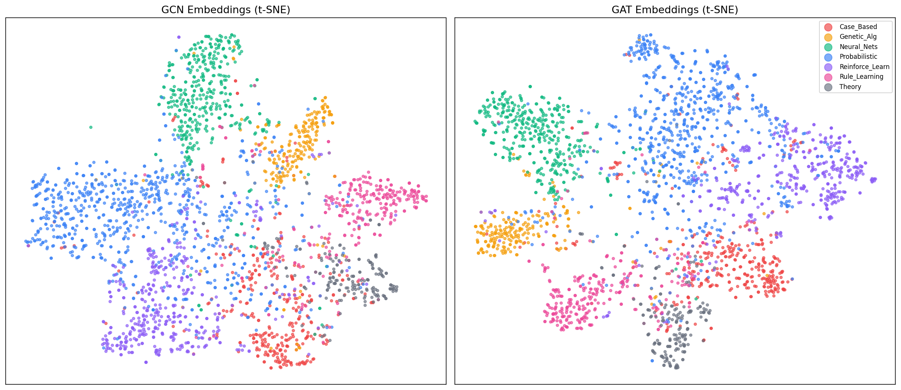
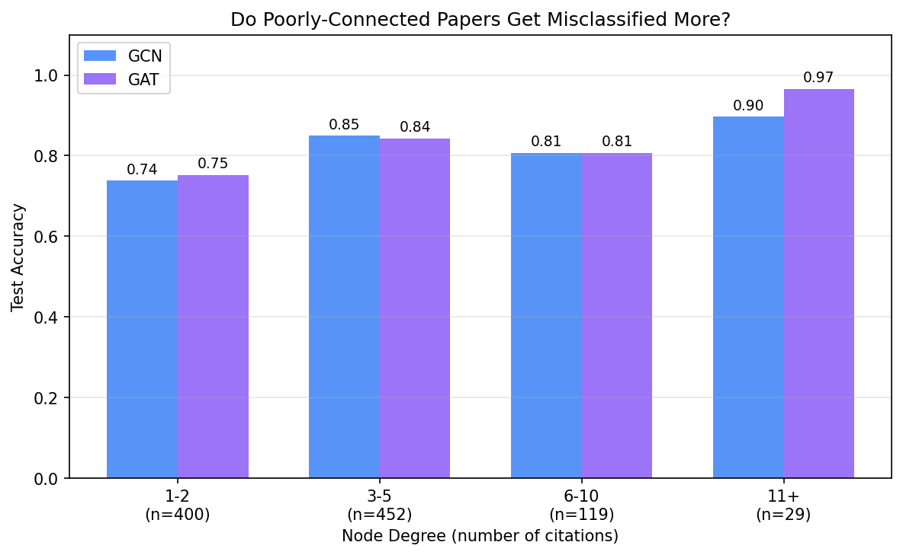
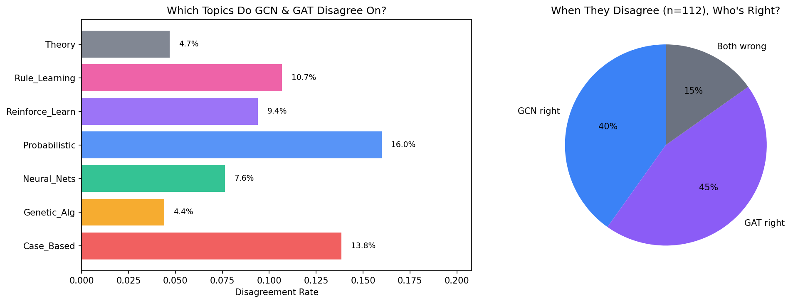
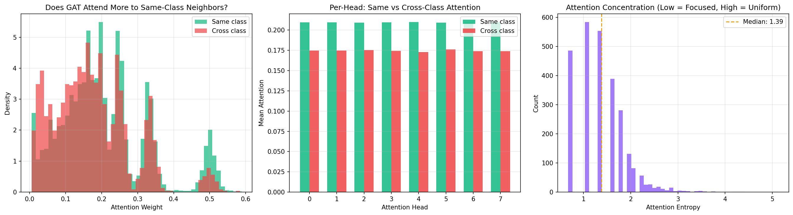

# Investigating Graph Neural Networks on a Citation Network

Node classification on the **Cora citation network** using two GNN architectures (GCN and GAT), with a systematic investigation into where they fail, where they disagree, and what GAT's attention mechanism actually learns.


---

## Overview

Cora is a graph of 2,708 machine learning papers connected by 5,429 citation links. Each paper has a 1,433-dimensional bag-of-words feature vector and belongs to one of 7 CS research topics. The standard split uses just **140 labeled nodes** for training, forcing the model to exploit graph structure to generalize to 1,000 test nodes.

| Property | Value |
|----------|-------|
| Nodes | 2,708 papers |
| Edges | 5,429 citations |
| Features | 1,433 (bag-of-words) |
| Classes | 7 (Case-Based, Genetic Algorithms, Neural Networks, Probabilistic Methods, Reinforcement Learning, Rule Learning, Theory) |
| Train / Val / Test | 140 / 500 / 1,000 |

## Approach

**GCN** ([Kipf & Welling, 2017](https://arxiv.org/abs/1609.02907)) -- 2-layer Graph Convolutional Network. Aggregates neighbor features with fixed weights from the graph structure. All neighbors contribute equally. ~12K parameters.

**GAT** ([Velickovic et al., 2018](https://arxiv.org/abs/1710.10903)) -- 8-head Graph Attention Network. Learns per-edge attention weights so the model can focus on informative neighbors. ~92K parameters.

Both trained with Adam (lr=0.01, weight decay=5e-4) and early stopping on validation accuracy.

## Results

| Model | Parameters | Test Accuracy |
|-------|-----------|---------------|
| GCN | ~12,500 | **80.1%** |
| GAT | ~92,000 | **80.6%** |

### Learned Embeddings (t-SNE)



Both models learn to separate the 7 topic classes in representation space. GAT's clusters show slightly tighter grouping, consistent with attention helping pull same-class nodes closer together.

---

## Key Findings

### 1. Low-degree nodes are the failure mode



Papers with only 1-2 citations hit **~74% accuracy** -- a 16-23 point drop compared to highly-cited papers (90-97%). This is the most natural failure mode for message-passing GNNs: fewer neighbors means fewer messages, which means weaker representations. GNN papers rarely report accuracy-by-degree, but it's arguably more informative than a single aggregate number.

### 2. Probabilistic Methods sits at the graph's semantic crossroads



GCN and GAT agree on **~89%** of test predictions. On the ~110 nodes where they disagree, GAT is right slightly more often than GCN. But the striking pattern is *which class* drives the disagreement: **Probabilistic Methods** accounts for ~16% disagreement rate, far ahead of any other topic. It gets confused with Case-Based, Reinforcement Learning, Genetic Algorithms, and Neural Networks -- nearly every other class. This isn't a model failure; it reflects the topic's position as a methodological bridge that gets cited across subfields.

### 3. GAT learns homophily, but all heads learn the same thing



GAT assigns **1.20x higher attention** to same-class neighbors compared to cross-class neighbors. The model discovers citation homophily (papers tend to cite papers in the same field) without being told about it. However, all 8 attention heads show nearly identical same-vs-cross bias (deltas range 0.033-0.037). There is no head specialization -- the architecture provides 8 heads, but they converge to redundant strategies. This suggests that for Cora's relatively simple homophily structure, fewer heads would suffice.

The attention entropy distribution clusters low (median ~1.4), meaning most nodes concentrate attention on a few key neighbors rather than spreading it uniformly. GAT is genuinely *selecting*, not just averaging.

---

## How to Run

### Prerequisites

- Python 3.8+
- PyTorch 2.12+ (tested on CPU; CUDA works automatically if available)
- PyTorch Geometric 2.7+

> **Note on PyG installation:** PyTorch Geometric depends on your exact PyTorch and CUDA versions. If `pip install torch-geometric` fails, check [the official install guide](https://pytorch-geometric.readthedocs.io/en/latest/install/installation.html) for your setup.

### Installation

```bash
git clone https://github.com/umerazam007/graph-ml-citation-network.git
cd graph-ml-citation-network
pip install -r requirements.txt
```

### Run

```bash
python main.py
```

Trains both models, runs all four analyses, and saves plots to `results/`. Takes ~2 minutes on CPU.

```bash
# Custom hyperparameters
python main.py --epochs 300 --lr 0.005 --patience 50
```

| Flag | Default | Description |
|------|---------|-------------|
| `--epochs` | `200` | Max training epochs |
| `--lr` | `0.01` | Learning rate |
| `--wd` | `5e-4` | Weight decay (L2) |
| `--patience` | `30` | Early stopping patience |

## Project Structure

```
graph-ml-citation-network/
├── main.py                # Entry point: train both models, run investigation
├── src/
│   ├── models.py          # GCN and GAT architectures
│   ├── train.py           # Data loading, training loop, evaluation
│   └── analysis.py        # All four analyses + visualization
├── results/
│   ├── degree_vs_accuracy.png
│   ├── disagreement_analysis.png
│   ├── attention_analysis.png
│   ├── embedding_comparison.png
│   └── metrics.md
├── requirements.txt
└── .gitignore
```

## What I Learned

The accuracy gap between GCN and GAT on Cora is small (~0.5%), but the *reasons* they fail are structurally different. GCN treats all neighbors equally and struggles when the neighborhood is sparse or noisy. GAT has the machinery to be selective, and the attention weights confirm it does learn to focus -- but on this dataset, all 8 heads converge to the same strategy, suggesting the graph's homophily structure is simple enough that one attention pattern suffices. The real insight isn't which model is "better" -- it's that node degree is a stronger predictor of classification difficulty than model architecture.

## References

- **Cora dataset:** McCallum et al., *Automating the Construction of Internet Portals with Machine Learning*, 2000
- **GCN:** Kipf & Welling, [*Semi-Supervised Classification with Graph Convolutional Networks*](https://arxiv.org/abs/1609.02907), ICLR 2017
- **GAT:** Velickovic et al., [*Graph Attention Networks*](https://arxiv.org/abs/1710.10903), ICLR 2018
- **PyTorch Geometric:** Fey & Lenssen, [*Fast Graph Representation Learning with PyTorch Geometric*](https://arxiv.org/abs/1903.02428), ICLR-W 2019
